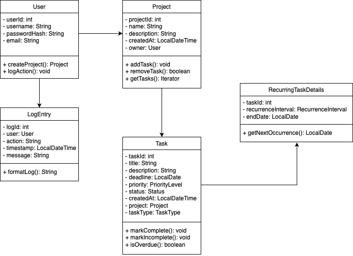

# Todo Management System - Technical Architecture
The Todo Management System is designed as a modular Java SE application with clean separation of concerns and extensible architecture.

### Build Commands Reference
```bash
mvn clean compile          # Compile source
mvn test                   # Run tests
mvn clean install          # Full build
mvn exec:java              # Run application
```

### Credentials
- **Username**: `admin`
- **Password**: `admin`

For testing purposes, the application uses a default admin user with the above credentials. You can change these in the database or through the application settings.
### Features
- **Todo Management**: Create, read, update, delete (CRUD) operations for todos.
- **Project Management**: Create, read, update, delete (CRUD) operations for projects.
- **CLI Interface**: Interactive command-line interface for user interaction.
- **Data Persistence**: Uses SQLite for data storage.
- **Error Handling**: Comprehensive error handling with custom exceptions.
- **Logging**: Basic logging system for tracking application events.

### Technologies Used
- **Java SE**: Core programming language.
- **SQLite**: Lightweight database for data persistence.
- **JUnit**: Testing framework for unit tests.
- **Maven**: Build automation tool for managing dependencies and building the project.


### Architecture Overview

```
┌───────────────────────────────────────────────────────────┐
│                    Presentation Layer                     │
│  ┌─────────────┐  ┌─────────────┐  ┌─────────────────┐    │
│  │     CLI     │  │   Console   │  │  Future: GUI    │    │
│  │ Interface   │  │  Interface  │  │    Interface    │    │
│  └─────────────┘  └─────────────┘  └─────────────────┘    │
└───────────────────────────────────────────────────────────┘
                               │
┌───────────────────────────────────────────────────────────┐
│                    Business Logic Layer                   │
│  ┌─────────────┐  ┌─────────────┐  ┌─────────────────┐    │
│  │    Todo     │  │   Project   │  │    Reporting    │    │
│  │   Service   │  │   Service   │  │     Service     │    │
│  └─────────────┘  └─────────────┘  └─────────────────┘    │
└───────────────────────────────────────────────────────────┘
                               │
┌───────────────────────────────────────────────────────────┐
│                    Data Access Layer                      │
│  ┌─────────────┐  ┌─────────────┐  ┌─────────────────┐    │
│  │    Todo     │  │   Project   │  │   Database      │    │
│  │     DAO     │  │     DAO     │  │  Connection     │    │
│  └─────────────┘  └─────────────┘  └─────────────────┘    │
└───────────────────────────────────────────────────────────┘
                               │
┌───────────────────────────────────────────────────────────┐
│                    Persistence Layer                      │
│  ┌─────────────┐                   ┌─────────────────┐    │
│  │   SQLite    │                   │     Logging     │    │
│  │  Database   │                   │     System      │    │
│  └─────────────┘                   └─────────────────┘    │
└───────────────────────────────────────────────────────────┘
```

## Core Components

## UML Diagrams

### 1. Class Diagram




#### Todo Entity
```java
public class Todo {
    private Long id;
    private String title;
    private String description;
    private LocalDate dueDate;
    private Priority priority;
    private TodoStatus status;
    private Long projectId;
    private LocalDateTime createdAt;
    private LocalDateTime updatedAt;
}
```

#### Project Entity
```java
public class Project {
    private Long id;
    private String name;
    private String description;
    private LocalDate startDate;
    private LocalDate endDate;
    private List<Todo> todos;
    private LocalDateTime createdAt;
    private LocalDateTime updatedAt;
}
```

#### Enumerations
```java
public enum Priority {
    LOW, MEDIUM, HIGH, URGENT
}

public enum TodoStatus {
    TODO, IN_PROGRESS, COMPLETED, CANCELLED
}
```

### 2. Data Access Layer

#### TodoDAO Interface
```java
public interface TodoDAO {
    Todo create(Todo todo);
    Todo findById(Long id);
    List<Todo> findAll();
    List<Todo> findByProject(Long projectId);
    List<Todo> findByStatus(TodoStatus status);
    Todo update(Todo todo);
    boolean delete(Long id);
}
```

#### ProjectDAO Interface
```java
public interface ProjectDAO {
    Project create(Project project);
    Project findById(Long id);
    List<Project> findAll();
    Project update(Project project);
    boolean delete(Long id);
}
```

### 3. Business Logic Layer

#### TodoService
- Todo CRUD operations
- Business rule validation
- Todo status management
- Due date management
- Priority handling

#### ProjectService
- Project CRUD operations
- Todo assignment to projects
- Project progress tracking
- Project completion status

### 4. Presentation Layer

#### CLI Interface
- Interactive menu system
- Command-line argument parsing
- User input validation
- Formatted output display

## Design Patterns

### 1. Factory Pattern
```java
public class TodoFactory {
    public static Todo createTodo(TodoType type, String title) {
        // Factory logic for different todo types
    }
}
```

### 2. Composite Pattern
```java
public interface TodoComponent {
    void display();
    void add(TodoComponent component);
    void remove(TodoComponent component);
}
```

### 3. Observer Pattern
```java
public interface TodoObserver {
    void onTodoStatusChanged(Todo todo);
    void onTodoDeleted(Long todoId);
}
```

### 4. Command Pattern
```java
public interface Command {
    void execute();
    void undo();
}
```

## Database Schema

### Todos Table
```sql
CREATE TABLE todos (
    id INTEGER PRIMARY KEY AUTOINCREMENT,
    title TEXT NOT NULL,
    description TEXT,
    due_date DATE,
    priority TEXT CHECK(priority IN ('LOW', 'MEDIUM', 'HIGH', 'URGENT')),
    status TEXT CHECK(status IN ('TODO', 'IN_PROGRESS', 'COMPLETED', 'CANCELLED')),
    project_id INTEGER,
    created_at TIMESTAMP DEFAULT CURRENT_TIMESTAMP,
    updated_at TIMESTAMP DEFAULT CURRENT_TIMESTAMP,
    FOREIGN KEY (project_id) REFERENCES projects(id)
);
```

### Projects Table
```sql
CREATE TABLE projects (
    id INTEGER PRIMARY KEY AUTOINCREMENT,
    name TEXT NOT NULL UNIQUE,
    description TEXT,
    start_date DATE,
    end_date DATE,
    created_at TIMESTAMP DEFAULT CURRENT_TIMESTAMP,
    updated_at TIMESTAMP DEFAULT CURRENT_TIMESTAMP
);
```

## Error Handling Strategy

### Exception Hierarchy
```java
public abstract class TodoManagementException extends Exception {
    // Base exception class
}

public class TodoNotFoundException extends TodoManagementException {
    // Todo-specific exception
}

public class DatabaseException extends TodoManagementException {
    // Database-related exception
}

public class ValidationException extends TodoManagementException {
    // Input validation exception
}
```
